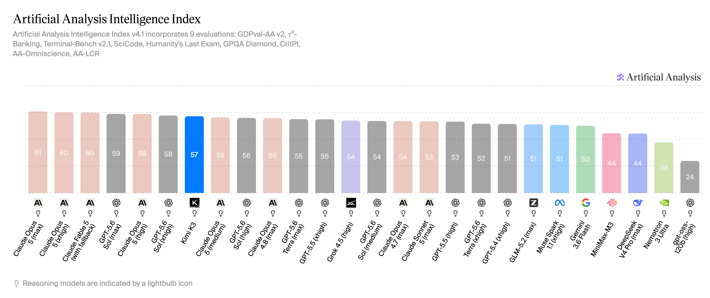

# Kimi K3

---

## Table of Contents

- [Kimi K3](#kimi-k3)
  - [Table of Contents](#table-of-contents)
  - [Quickstart](#quickstart)
  - [Try it Out](#try-it-out)
  - [TL;DR](#tldr)
    - [Key highlights](#key-highlights)
  - [Examples and Resources](#examples-and-resources)
  - [Performance and Benchmarks](#performance-and-benchmarks)
  - [References](#references)

---

## Quickstart

```python
import os
from openai import OpenAI

client = OpenAI(
    base_url="https://api.tokenfactory.us-central1.nebius.com/v1/",
    api_key=os.environ.get("NEBIUS_API_KEY")
)

response = client.chat.completions.create(
    model="moonshotai/Kimi-K3",
    messages=[{"role": "user", "content": "Explain quantum computing in one sentence."}]
)
print(response.choices[0].message.content)
```

## Try it Out

[▶ Try it in the Token Factory Playground](https://tokenfactory.nebius.com/playground?models=moonshotai/Kimi-K3)

## TL;DR

Kimi K3 is Moonshot AI's flagship reasoning model, released July 16, 2026 — a major step up in intelligence over the Kimi K2.5 / K2.6 / K2.7 lineage, with multimodal (text + image) input and a 1M-token context window.

- **Provider:** Moonshot AI (Kimi)
- **Architecture:** Proprietary — 2.8T parameters
- **Context window:** 1M tokens
- **Strengths:** Reasoning, knowledge, mathematics, coding, agentic tasks, multimodal (image) understanding
- **License:** Proprietary (Moonshot AI)

### Key highlights

- First Open weights model to approach 3 T parameter count.
- Scores 57 on the Artificial Analysis Intelligence Index, ranking #7 of 190 models (category median: 32)
- Multimodal input — supports text and image; outputs text

---

## Examples and Resources

- [Charlie in Token Factory RPG game built with Kimi 3](https://datamon.vercel.app/)

---

## Performance and Benchmarks



---

## References

- [Artificial Analysis — Kimi K3](https://artificialanalysis.ai/models/kimi-k3)
- [Moonshot AI](https://www.moonshot.ai/)
- [Kimi](https://www.kimi.com/)
